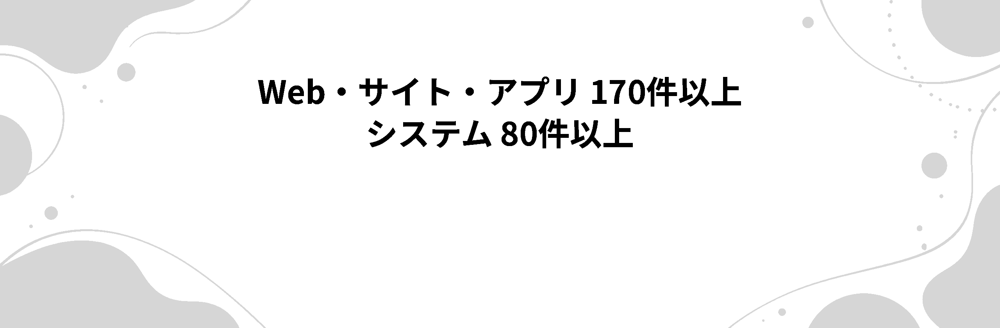

 

 

## ブラックにゃー

大阪でフリーランスのWebエンジニアをしています。受託が中心で、業務システムと企業サイトを半々くらいの比率で作っています。

技術そのものより、現場で実際に回るかどうかを気にするほうです。誰がいつ触っても壊れない、引き継いでも読める、そういう作りを心がけています。

 

## 最近つくったもの

| | |
|---|---|
| [sktes-global-auction](https://github.com/blacknyaa/sktes-global-auction) | 中古IT機器の国際競売プラットフォーム。入札額をロットごとの鍵で暗号化し、締切まで出品者にも管理者にも見えない封印入札。Excel明細の取り込み、多要素認証、7年保存の監査ログ、日英中の3言語対応。Next.js 15 / Prisma / TypeScript |
| [work-report-system](https://github.com/blacknyaa/work-report-system) | 病院設備の保守点検報告書システム。さくらのレンタルサーバで動かす必要があったので、外部ライブラリを一切使わず素のPHPで組んでいます |
| [teachingbeauty-migration-to-wp](https://github.com/blacknyaa/teachingbeauty-migration-to-wp) | 鍼灸整骨院サイトのWordPress移行。既存の予約導線を落とさないことが最優先の案件でした |

このほか、手術予約の管理システム、製造業の生産管理、特定技能外国人の支援計画書を印刷まで含めてHTML化したもの、などを非公開リポジトリで。

 

## 書いているもの

[Zenn の下書き置き場](https://github.com/blacknyaa/my-zenn-articles)。詰まったところと、その回避策を中心に。

 

## 技術スタック

### バックエンド
<table>
<tr>
  <td align="center"> Python</td>
  <td align="center"> FastAPI</td>
  <td align="center"> JavaScript</td>
  <td align="center"> TypeScript</td>
  <td align="center"> Node.js</td>
  <td align="center"> Express</td>
  <td align="center"> PHP</td>
  <td align="center"> Laravel</td>
  <td align="center"> NestJS</td>
  <td align="center"> Django</td>
</tr>
</table>

### データベース
<table>
<tr>
  <td align="center"> PostgreSQL</td>
  <td align="center"> MySQL</td>
  <td align="center"> MongoDB</td>
  <td align="center"> Redis</td>
  <td align="center"> Prisma</td>
  <td align="center"> Supabase</td>
  <td align="center"> Elasticsearch</td>
  <td align="center"> RabbitMQ</td>
</tr>
</table>

### フロントエンド
<table>
<tr>
  <td align="center"> React</td>
  <td align="center"> Next.js</td>
  <td align="center"> Vue.js</td>
  <td align="center"> Angular</td>
  <td align="center"> WordPress</td>
  <td align="center"> Tailwind CSS</td>
  <td align="center"> Figma</td>
</tr>
</table>

### インフラ・運用
<table>
<tr>
  <td align="center"> Docker</td>
  <td align="center"> Kubernetes</td>
  <td align="center"> AWS</td>
  <td align="center"> Nginx</td>
  <td align="center"> GitHub Actions</td>
  <td align="center"> Terraform</td>
  <td align="center"> Prometheus</td>
  <td align="center"> Linux</td>
</tr>
</table>

新しいものに飛びつくより、枯れたものを正しく使うほうが好きです。ただ、必要があれば何でも触ります。さくらのレンタルサーバのような制約の多い環境も、慣れています。

 

## 仕事のご相談

ランサーズ経由と直接依頼、どちらも受けています。要件が固まっていない段階からでも構いません。

 

---

 

## English

Freelance web engineer based in Osaka, Japan.

I build business systems and corporate websites on contract — currently mostly TypeScript and Next.js, with a fair amount of PHP still in rotation for shared-hosting environments.

Recent work includes a sealed-bid auction platform for international IT asset trading (per-lot RSA encryption of bid amounts, Excel manifest import, TOTP multi-factor auth, seven-year audit log, trilingual UI), a maintenance reporting system for hospital facilities written in dependency-free PHP to fit a constrained shared host, and a WordPress migration for a clinic site where the existing booking flow could not be allowed to break.

I care more about whether something holds up in production than about which framework it uses. Open to contract work, including projects where the requirements are still taking shape.
